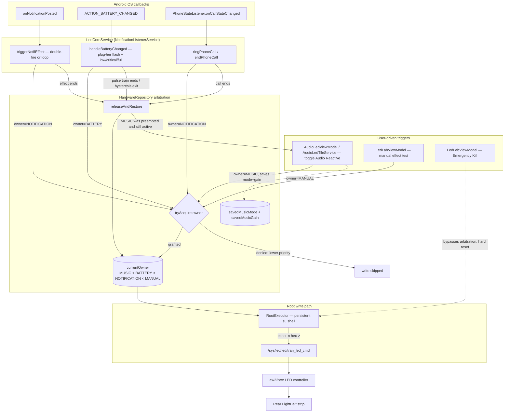

# LEDSync

<p align="center">
  
</p>

[](https://github.com/Swaggyxren/LEDSync)
[](https://kotlinlang.org/)
[](https://developer.android.com/jetpack/compose)
[](https://m3.material.io/)
[](#ai-assisted-development)

Native Android application built with Kotlin, Jetpack Compose, and Hilt that interfaces directly with kernel sysfs LED hardware drivers (`/sys/class/leds/`).

---

## Features

- **Audio Reactive LED**: Real-time audio spectrum visualization and static white modes, featuring a Quick Settings tile and an adjustable Reactivity slider.
- **Notification LED Sync**: Per-app custom LED effect mapping with 24/7 background sync.
- **Battery LED Studio**: Low, Critical, Charging, and Full battery LED triggers with discrete threshold sliders.
- **Material 3 Expressive UI**: Physics spring animations, floating nav dock, and dynamic Light/Dark system theme support.
- **Performance Monitor**: Real-time CPU sparkline chart, RAM allocation, storage capacity, and system uptime.
- **Security & Reliability**: Root permission gate and notification listener access checks.

---

## How LEDSync Works

Every LED trigger in the app — notifications, battery, phone calls, audio-reactive mode, manual
testing — funnels through the same arbitration layer before it ever touches hardware, so a
transient effect (a notification, an incoming call) can cleanly interrupt an ambient one (music
mode, a battery pulse) and hand control back when it's done, instead of two triggers racing to
write the same sysfs node.



**Reading it**: any of the five trigger sources on the left calls into `HardwareRepository` with a
declared priority tier. `tryAcquire` only lets the write through if nothing higher-priority is
already active — a stray battery pulse can't stomp a notification blip mid-animation, for example.
Every transient trigger (notification, battery, call) calls `releaseAndRestore` when it finishes,
which hands control back to Audio Reactive mode automatically if it was playing before getting
interrupted. The actual hardware write, all the way at the bottom, is identical regardless of which
trigger caused it: a plain `su` shell writing 6 space-separated hex bytes to the same sysfs node the
stock Transsion firmware itself uses — reverse-engineered from the decompiled
`transsion-light-services.jar`.

---

## Requirements

- Android 8.0+ (API 26+)
- Root access (Magisk, KernelSU, or APatch)
- Notification Access enabled (Settings → Special app access → Notification access)

---

## Building from Source

```bash
git clone https://github.com/Swaggyxren/LEDSync.git
cd LEDSync/android
./gradlew assembleRelease
```

---

## AI-Assisted Development

This project is built mostly with AI assistance — Google Antigravity and Claude (Anthropic) handled the bulk of the implementation, including the native Kotlin rewrite, hardware protocol reverse-engineering, and ongoing feature work. Direction, testing, and hardware validation are human-driven.

---

## Author

- **Developer**: Xi'annnnnn ([@kasajin001](https://github.com/Swaggyxren))
- **License**: Open Source
